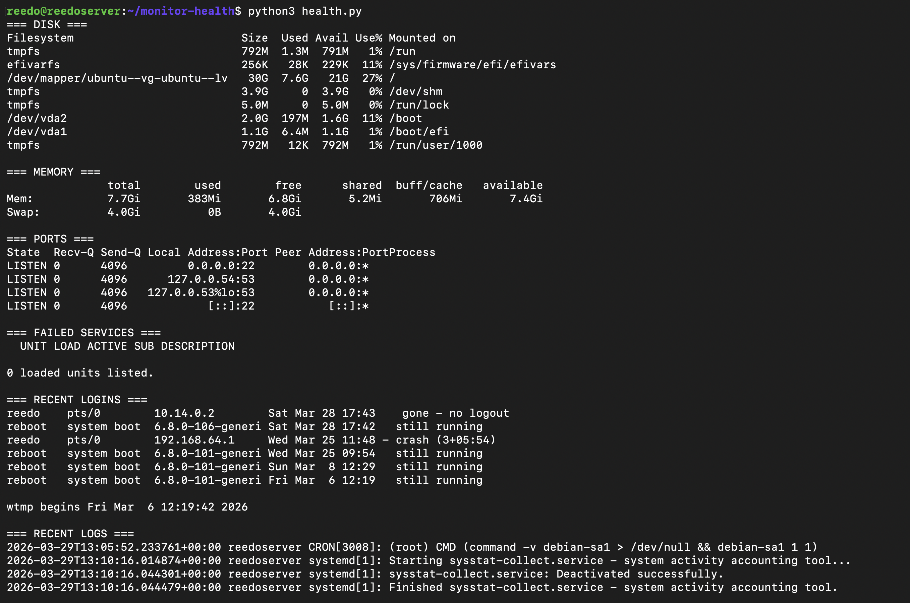

# AI-Powered Linux Health Monitor

A real-time Linux system monitoring tool that collects live metrics and uses Groq AI to generate plain-English health reports.

## What it does
- Collects disk, memory, open ports, failed services, and login history
- Sends data to Groq LLM for intelligent analysis
- Outputs a human-readable diagnostic report

## Tools Used
- Python 3
- Bash/Linux native commands (df, free, ss, systemctl, last)
- Groq AI API (llama-3.1-8b-instant)
- Ubuntu Server 24.04

## How to Run
1. Clone the repo
2. Add your Groq API key in health.py
3. Run python3 health.py

## Sample Output
AI analyzes your system and returns findings like disk usage warnings,
failed services, suspicious logins, and recommendations.

